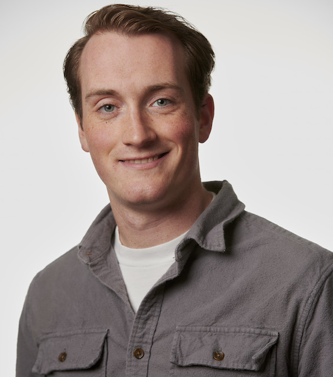

## trevor karn

### about 

i'm a mathematics phd student at the University of Minnesota

my research interests are in algebraic combinatorics and
applied topology

my pronouns are he/him

### combinatorics seminar

in 2021, the UMN student algebra and combinatorics seminar organizers are Robbie Angarone, Carolyn Stephen, and Sasha Pevzner. the schedule can be found at [Sasha's website](https://www-users.cse.umn.edu/~pevzn002/SCAS/student_seminar_f21.html)

[here](https://www-users.cse.umn.edu/~karnx018/2020.html) is the schedule of speakers from 2020

### publications

[Modeling a Hidden Dynamical System Using Energy Minimization and Kernel Density Estimates](https://arxiv.org/abs/1904.05172) (with Steven Petrone and Christopher Griffin), Physical Review E **100** (2019)

[Stirling numbers in braid matroid Kazhdan–Lusztig polynomials](https://www.sciencedirect.com/science/article/pii/S0196885818301052) (with Max D. Wakefield), Advances in Applied Mathematics **103** (2019)

### teaching

i have taught the following classes at UMN:

- linear algebra and differential equations (math 2243), fall 2020, spring 2021
- calculus ii (spring 2020, fall 2021)
- calculus i (fall 2019)

### open source development

i'm a fan of python. in particular, sagemath.
since 2020 i have been contributing to sagemath.

in summer 2021 i participated in the [Google Summer of Code](https://summerofcode.withgoogle.com/projects/#6722452844969984) with sagemath.

### prelims 

check out [complex analysis preliminary written exam solutions](https://github.com/trevorkarn/umn-complex-prelim) and 
[manifolds and topology preliminary written exam solutions](https://github.com/trevorkarn/umn-topology-prelim). 
i am no longer actively updating them, so please make pull requests
to keep them up-to-date!
